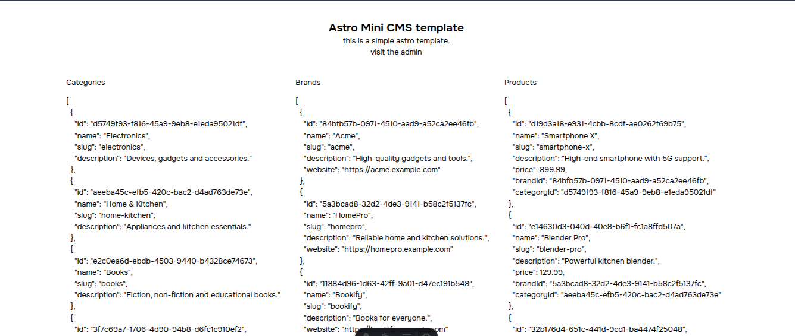
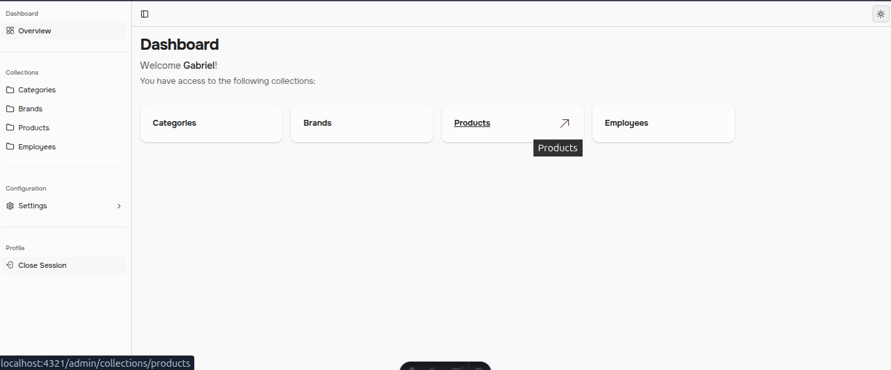
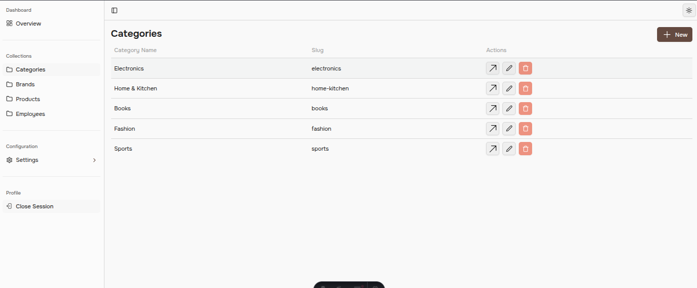
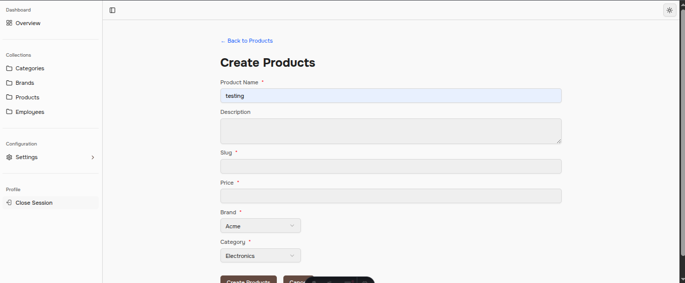

# Astro Mini CMS template

[](https://astro.build/)
[](https://astro.build/db)
[](https://www.typescriptlang.org/)
[](https://tailwindcss.com/)
[](https://turso.tech/)
[](https://vercel.com/)

This project use [Basecoat](https://basecoatui.com/)

This template was inspired by PayloadCMS, I must also give credit to StudioCMS, it inspired me to experiment a little.

## Demo






## How do I define a collection?

```ts
// collections/brands.ts
import { z } from "zod";
import { brand } from "astro:db";
import type { Collection } from "@/types/collections";

const brandSchema = z.object({
  id: z.string().optional(),
  slug: z.string(),
  name: z.string().min(1),
  description: z.string().optional(),
  website: z.string().optional(),
});

export const brandsCollection = {
  label: "Brands",
  table: brand,
  schema: brandSchema,
  fieldMap: [
    {
      field: "id",
      fieldComponent: "text-field",
      label: "ID",
    },
    {
      field: "name",
      fieldComponent: "text-field",
      required: true,
      label: "Brand Name",
    },
    {
      field: "description",
      fieldComponent: "textarea-field",
      label: "Description",
      placeholder: "Optional brand description",
    },
    {
      field: "slug",
      fieldComponent: "text-field",
      required: true,
      label: "Slug",
      placeholder: "brand-slug",
    },
    {
      field: "website",
      fieldComponent: "url-field",
      label: "Website",
      placeholder: "https://example.com",
    },
  ],
} satisfies Collection<typeof brandSchema>;
```

## How to run this project

first install the dependencies

```bash
npm install
```

create a `.env` file based on the `.env.example` file

migrate the database

```bash
npm run db:push
```

Run this command for create a new user

```bash
npm run manage
```

### How to added new collections

- Define your tables in the `db/config.ts` file
- Create a new file in the `src/collections` folder
- Add the collection name in the `src/collections.ts` file
- Migrate the database
  ```bash
  npm run db:push
  ```
